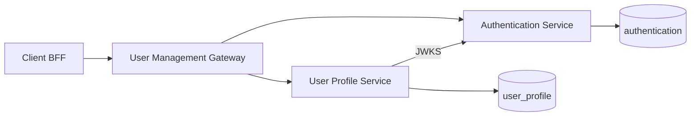
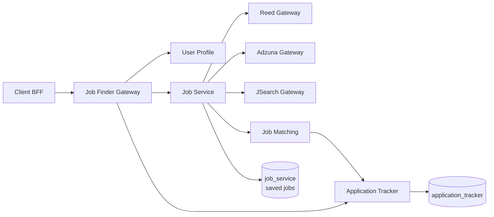
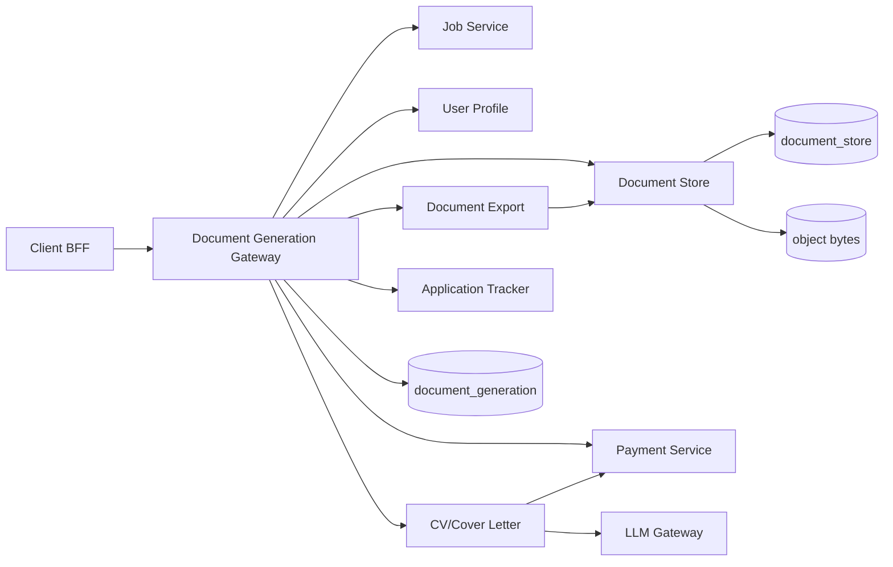
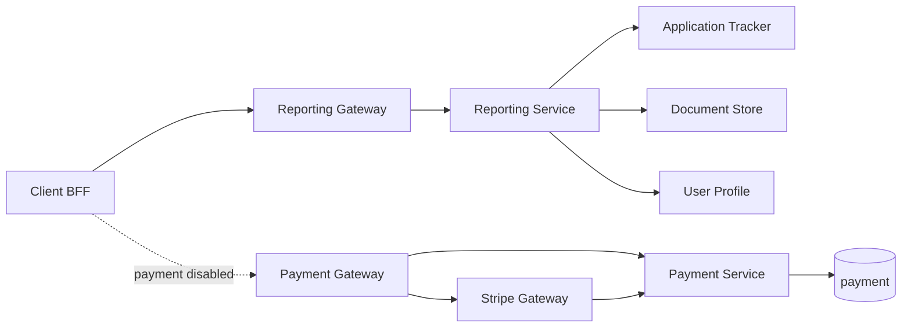
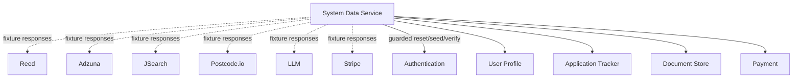

# Dependency maps

Arrows show runtime HTTP calls on `develop`, not build-time generated-client dependencies.

## Account and profile

## Job search and applications

## Document generation

## Reporting and payment

## Fixture boundary

System Data is deliberately outside production ownership. It serves versioned synthetic provider responses and coordinates service-owned non-production management APIs. It does not bypass APIs or share databases.
