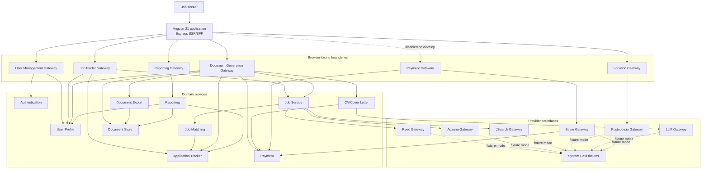

# System overview

## Runtime layers

## Identity path

Authentication Service signs short-lived access tokens and exposes public verification keys. User Management Gateway owns the browser session boundary: it places access and refresh tokens in HttpOnly cookies and manages CSRF. Browser JavaScript never receives those tokens.

The Express BFF accepts same-origin requests, extracts only approved cookie/session material, and forwards identity to the selected gateway. JWT resource services validate issuer, audience, signature, and subject. Internal calls use dedicated service tokens plus an owner header where the producer contract requires it.

## Persistence pattern

Seven runtime components persist state:

- Authentication Service
- User Profile Service
- Job Service (saved jobs only; searches are not persisted)
- Document Generation Gateway (durable coordinator operations)
- Document Store Service (metadata plus object bytes)
- Application Tracker Service
- Payment Service

Each owns a PostgreSQL database and Flyway migrations. No implementation on `develop` is allowed direct access to another service's database. Reporting is a read-only API projection and owns no database.

## Provider modes

Provider gateways run in one of three broad modes:

- `FIXTURE`: read deterministic responses from System Data; safe local default.
- `LIVE`: call the external provider with explicit credentials and enable switches.
- `DISABLED`: reject or omit provider work.

Infrastructure overlays deliberately control these modes. Fixture/E2E profiles forbid real Reed, Adzuna, JSearch, OpenAI, and Stripe secrets.

## Deliberate exceptions and inconsistencies

- The client BFF calls Document Store directly for a narrow set of metadata/download routes as well as using Document Generation Gateway. This is a documented retained boundary, not a general browser-to-service path.
- `system-data-service` knows many service URLs so it can coordinate guarded non-production reset/seed/verify APIs. It does not write their databases.
- Location on `develop` is a two-gateway chain (`location-gateway → postcode-io-gateway`). `location-service` and `google-maps-gateway` contain no runtime implementation on this branch.
- Service catalogue dependencies are operational hints; actual runtime calls are documented in the domain maps and journeys.
