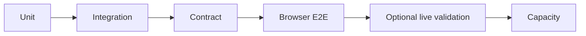

# Testing and coverage

Last coverage audit: **10 August 2026**

## Evidence layers

| Layer | What it establishes | What it does not establish |
| --- | --- | --- |
| Unit/component | Validation, mapping, rendering and deterministic edge behaviour | Cross-service compatibility |
| Integration | Persistence, authorization, service boundaries and failure mapping | Full user comprehension |
| Contract | Producer/consumer schema compatibility and generated-client drift | Provider uptime or output quality |
| Browser E2E | Real same-origin UI journeys against the multi-service stack | Every persona/capability combination |
| Live validation | Current external response shapes and representative AI quality | Cheap, repeatable regression |
| Capacity | A dated workload on a named host at explicit concurrency points | General registered-user scale |

## Persona × capability decision matrix

**E2E** means browser coverage is required; **API** is service/contract coverage;
**INT** is integration; **SAMPLE** is bounded optional live validation; **—** is
not applicable or not yet supported.

| Journey | Minimal | Typical | Rich | Stress | Uploaded CV | Manual first | Career changer |
| --- | --- | --- | --- | --- | --- | --- | --- |
| Register/onboard | E2E | E2E | API | API | E2E | E2E | API |
| Profile save/reload | E2E | E2E | INT | INT + boundary | E2E | E2E | INT |
| Search/matching/details | E2E | E2E | INT | perf sample | E2E | E2E | E2E |
| Location/commute | E2E | E2E | INT | INT | E2E | E2E | INT |
| Upload application CV | — | API | API | boundary | E2E PDF/DOCX | E2E DOCX | API |
| Generate CV/letter | fixture + SAMPLE | fixture + SAMPLE | fixture + SAMPLE | long-input SAMPLE | SAMPLE | fixture | SAMPLE |
| Documents/tracker | API | E2E | INT | INT | E2E | E2E | INT |
| Reporting | empty API | E2E | INT | substantial history | API | API | API |
| Logout/login/return | E2E | E2E | API | API | E2E | E2E | API |

This is a coverage decision matrix, not a claim that every cell has passed.
Detailed results and remaining gaps live in the E2E real-world coverage audit.

## Failure coverage retained

- all job providers unavailable;
- empty and invalid searches;
- ownership and cross-user denial;
- corrupt, spoofed, path-traversal, external-relationship and oversized
  application documents;
- insufficient AI credit and protected generation boundaries;
- stale state, session reload and reset cleanup;
- measured capacity timeout at 25 sessions.
