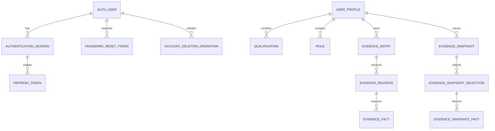
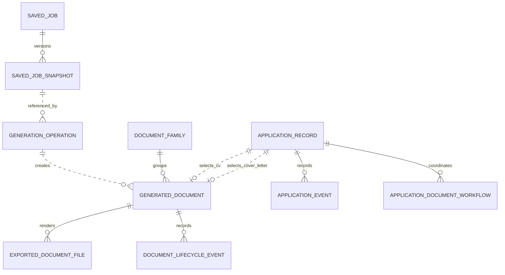
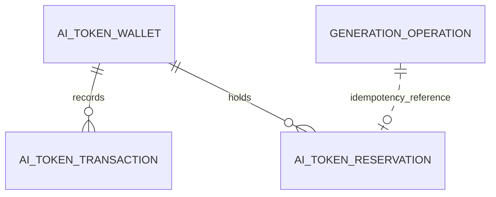

# Domain models

These diagrams show useful ownership relationships, not every table or Java class.

## Account and profile

Authentication and profile records are in separate databases. Their shared subject identifier is an API-level identity, not a foreign key.

## Saved jobs, documents, and applications

Dotted relationships cross an API/database boundary and are represented by immutable IDs, versions, hashes, and provenance—not relational foreign keys.

## Payment ledger

Transactions are the append-only audit trail. Reservations isolate estimated usage from later commit/release and can be recovered after interrupted document-generation steps.

## Application lifecycle data

`application_records` holds the current lifecycle projection and optimistic version. `application_events` is the immutable activity history. Separate selection/applied command tables make exact retries idempotent. Workflow and reconciliation tables record progress when Document Store calls cannot complete within the request.

## Document lifecycle data

`generated_documents` represents immutable versions (with family and parent lineage); `exported_document_files` represents stored artifacts. Storage operation/cursor tables reconcile metadata and object-provider effects. Lifecycle/activity tables retain audit events, while tombstones preserve content-free relationships after an approved purge.

