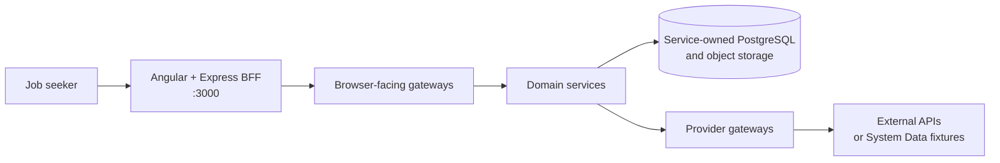

# Job Seeker Copilot

Technical documentation for the platform that helps a job seeker manage a profile and evidence, find and save jobs, track applications, and create application documents.

**Source of truth:** implementation on each repository's `develop` branch, audited 9 August 2026.

This is living documentation for the current development architecture. It
evolves alongside the repositories' `develop` branches and identifies features
as incomplete, disabled, or experimental until they are integrated and
verified.

## Start with the question you have

### What does it do?

Read the [product overview](product/overview.md) and current [implementation status](reference/implementation-status.md).

### What happens when…?

Follow an end-to-end [user journey](journeys/account-authentication.md), including the requests, services, stores, and providers involved.

### Where does this service fit?

Scan the [service catalogue](services/catalogue.md) or the [dependency maps](architecture/dependency-maps.md).

### Where does data live?

Use [data ownership](data/ownership.md) to identify the system of record and its access boundary.

### How do I run it?

Follow the verified [local development](infrastructure/local-development.md) path and [configuration reference](operations/configuration.md).

### What should I update?

Use the [change guide](development/change-guide.md) and [documentation maintenance checklist](development/documentation-maintenance.md).

## Platform at a glance

The browser uses same-origin BFF routes. The BFF sends session-derived identity to the appropriate gateway. Gateways validate identity and coordinate domain services; provider gateways isolate third-party protocols and credentials. Persistent domains own separate schemas and do not share a database.

!!! warning "Pre-release platform"
    The repositories describe private-beta hardening rather than a production release. Capability status is explicit throughout this site. Fixture mode is the safe local default; live integrations require deliberate overlays and credentials.

## Documentation path

This site is arranged so a new developer can drill down without first knowing repository names:

**Product → User journey → Architecture → Domain → Service → API → Data → Infrastructure**

Implementation-specific API details remain in producer-owned OpenAPI contracts and repository READMEs. The central site explains how those contracts work together.
