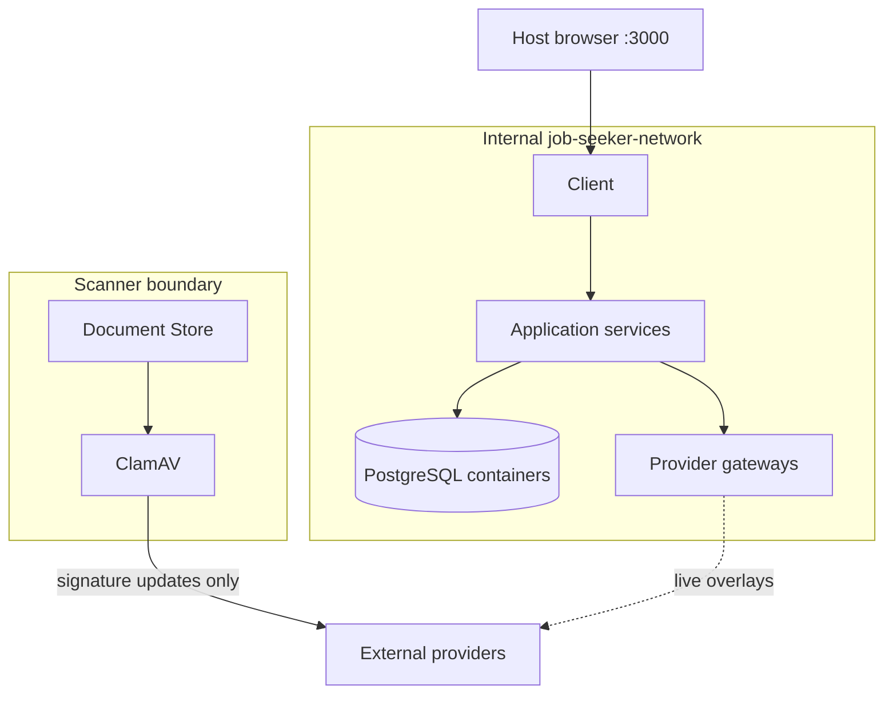

# Runtime architecture

## Local ports

| Port | Component | Port | Component |
|---:|---|---:|---|
| 3000 | Client SSR/BFF | 8080 | Job Finder Gateway |
| 8081 | Location Gateway | 8082 | Postcode.io Gateway |
| 8083 | User Management Gateway | 8084 | Authentication Service |
| 8085 | User Profile Service | 8086 | Job Service |
| 8087 | Reed Gateway | 8088 | Application Tracker |
| 8089 | Document Store | 8090 | LLM Gateway |
| 8091 | CV/Cover Letter | 8092 | Document Generation Gateway |
| 8094 | Document Export | 8095 | Reporting Gateway |
| 8096 | Reporting Service | 8097 | Job Matching Service |
| 8098 | Payment Gateway | 8099 | Payment Service |
| 8100 | Stripe Gateway | 8101 | Adzuna Gateway |
| 8102 | JSearch Gateway | 8103 | System Data Service |
| 9000 | Portainer (optional) | 9999 | Dozzle (optional) |

PostgreSQL containers are not published to the host by the base Compose. Java services use internal names such as `authentication-postgres:5432` and `job-service:8086`.

## Networks

The principal application network is Docker-internal. The client is the normal host entry point. The document scanner has an isolated Store/ClamAV network and a separate egress network for malware signatures. Operator tools mount the Docker socket only when their opt-in profile is selected.

## Compose profiles

| Profile | Purpose | External mode |
|---|---|---|
| `basic-fixture` | Account/profile/location/job-search development | Fixtures |
| `full-fixture` | Complete composed platform | Fixtures |
| `full-local-ses` | Full fixture plus production SES adapter against LocalStack | Fixtures + local SES |
| `real-job-providers` | Full platform with live Reed/Adzuna/JSearch | Live job providers; fixture LLM/Stripe |
| `real-providers` | Live jobs and OpenAI | Live jobs/LLM; fixture Stripe |

## Service discovery and readiness

Compose DNS uses service names. `depends_on: condition: service_healthy` establishes startup ordering but is not a runtime service mesh. Each component exposes an actuator or HTTP health probe. Infrastructure health scripts check the selected profile rather than assuming every repository runs.

## Images and builds

Most images build from sibling repository Dockerfiles. Repositories whose source intentionally excludes compiled artifacts are staged into disposable `.cache/runtime-images` contexts by build scripts. Java generated clients are rebuilt from locked producer revisions into the workspace-local Maven cache; copied JARs are not fleet build inputs.

Release profiles are intended to move toward digest-pinned registry images, but the current developer composition is source-built.

