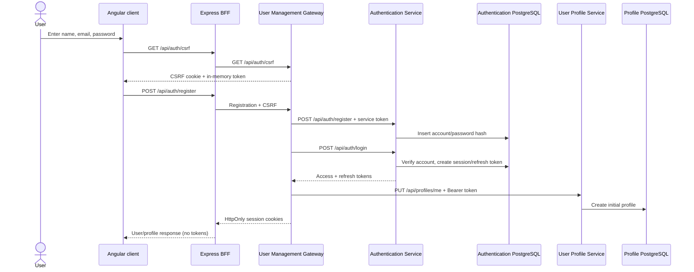

# Account and authentication

## Registration

The browser calls same-origin BFF routes. Registration is a coordinated, sequential workflow: create the credential account, establish a session, then create the initial profile with that access token.

Registration may accept an initial profile, but the current client sends only credentials and progressively saves profile sections later. If the downstream profile write fails after account creation, the account already exists; retry and error behaviour is therefore coordinated at the gateway rather than a cross-database transaction.

## Sign-in and session refresh

1. The client bootstraps a CSRF token.
2. `POST /api/auth/login` passes through BFF and User Management Gateway.
3. Authentication Service verifies the password and its adaptive login/lock controls.
4. User Management Gateway returns access and refresh tokens only as HttpOnly cookies.
5. The client validates the session by reading `/api/auth/profile`.
6. On an expired access session, one shared `POST /api/auth/refresh` rotates the refresh token and retries only a safe profile read.

State-changing requests are never automatically replayed. Logout revokes the server-side session and clears the cookies. Password reset uses single-use persisted reset tokens and revokes sessions when completion succeeds.

## Account lifecycle

The authenticated export/delete endpoints begin in Authentication Service, which coordinates owner-scoped calls to User Profile, Application Tracker, and Document Store. Deletion is retry-safe and tracked as an account-deletion operation rather than pretending that several service-owned stores can change atomically.

## Data touched

| Owner | Reads/writes |
|---|---|
| Authentication Service | Accounts, authentication sessions, refresh tokens, password-reset tokens, deletion operations |
| User Profile Service | Initial/current profile plus evidence and revisions |
| User Management Gateway/BFF | No database; session cookies and in-memory CSRF/session handling only |

## Important security boundaries

- Authentication Service `/api/auth/**` requires User Management Gateway's service identity; it is not a browser API.
- The public JWKS endpoint is used by resource services for token verification.
- Production CORS, cookie names, `Secure`, issuer, audience, key size, and service-token length are fail-closed configuration.
