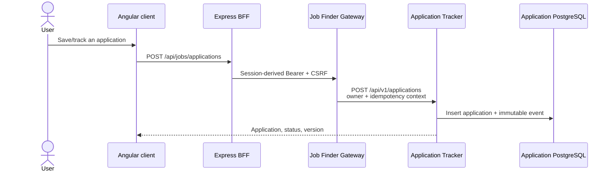
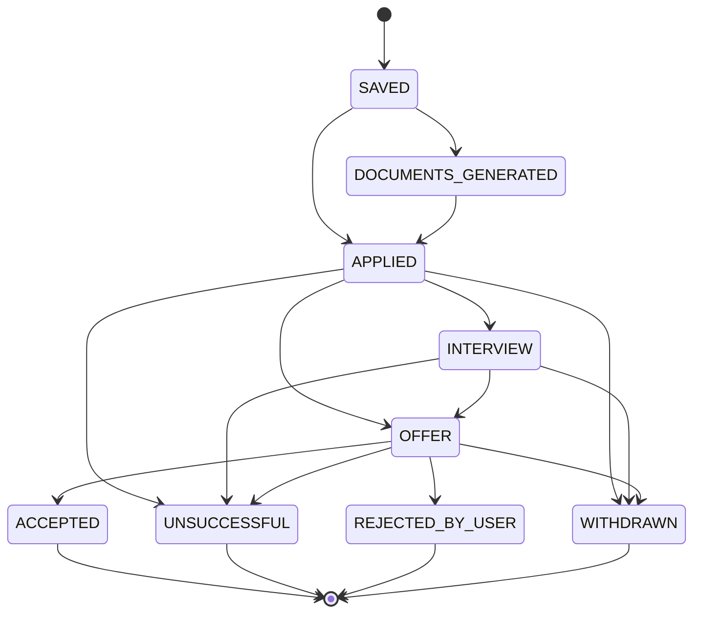

# Application tracking

Application Tracker is the system of record for applications, lifecycle state, exact applied document references, and immutable activity history.

## Manual or external application

Creation provenance is explicit:

| Provenance | Allowed starting state | Documents |
|---|---|---|
| `GENERATED` | `DOCUMENTS_GENERATED` or `APPLIED` | Approved generated references required by the selected flow |
| `MANUAL` | Defaults to `APPLIED`; may be `SAVED` | CV and cover letter independently optional while saved |
| `EXTERNAL` | Defaults to `APPLIED`; may be `SAVED` | CV and cover letter independently optional while saved |

Owner-scoped idempotency keys and database constraints make retries converge on one record.

## Lifecycle

Updates carry the record's expected optimistic version. Invalid or stale transitions return conflict. Exact command replays are idempotent. Every accepted mutation appends an actor/source-attributed event in the same database transaction.

## Document selections and apply-time freeze

While an application is `SAVED` or `DOCUMENTS_GENERATED`, the claimant can select or change its current CV and cover-letter version. The first successful transition to `APPLIED` verifies those selections and atomically freezes each chosen document's ID, family, version, hash, evidence provenance, and any explicit omission. Later changes cannot rewrite what was used for the application.

## Replacement and withdrawal

Cross-service document replacement and generated-application withdrawal cannot be one database transaction. Application Tracker therefore persists a workflow operation before calling Document Store and returns either completed `200` or recovery-pending `202`. Operation IDs, stable downstream keys, and reconciliation state make retry/recovery visible.

## Archive, delete, and history

Application deletion is an owner-scoped lifecycle action, not an unguarded database delete. Immutable application events support reporting and audit. Account deletion uses a separate internal owner-scoped API coordinated by Authentication Service.

