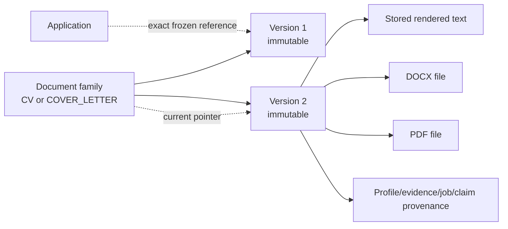

# CVs, cover letters, and documents

## Generation and approval

The normal path starts from an immutable saved-job snapshot and creates a durable operation. No application is created before the user approves the exact drafts.

```mermaid
sequenceDiagram
  actor User
  participant UI as Angular client
  participant BFF as Express BFF
  participant Gateway as Document Generation Gateway
  participant Job as Job Service
  participant Profile as User Profile Service
  participant Payment as Payment Service
  participant Generator as CV/Cover Letter Service
  participant LLM as LLM Gateway
  participant Store as Document Store
  participant Export as Document Export
  participant Tracker as Application Tracker

  User->>UI: Generate CV and/or cover letter for saved job
  UI->>BFF: POST saved-jobs/{id}/operations
  BFF->>Gateway: Session-derived Bearer
  Gateway->>Gateway: Persist owner-scoped operation + deadline
  Gateway->>Job: Resolve immutable saved-job snapshot
  Gateway->>Profile: Create/resolve purpose-bound evidence snapshot(s)
  Gateway->>Generator: Estimate selected output(s)
  Generator-->>Gateway: Conservative usage estimate
  Gateway->>Payment: Reserve one credit per requested document
  Gateway->>Generator: Generate selected draft(s)
  Generator->>LLM: Typed generation request
  LLM-->>Generator: Content + usage/model evidence
  Generator-->>Gateway: Validated drafts + claim ledger
  Gateway->>Store: Create immutable DRAFT version(s)
  Gateway->>Payment: Commit delivered document credits
  Gateway-->>UI: AWAITING_APPROVAL + exact draft IDs
  User->>UI: Approve exact draft(s)
  UI->>Gateway: POST operations/{id}/approve
  Gateway->>Store: Approve/current exact versions
  Gateway->>Export: Render DOCX/PDF with stable keys
  Export->>Store: Read text; store exported files
  Gateway->>Tracker: Create generated application with exact references
  Gateway-->>UI: Completed operation + downloads/application
```

The user can select CV, cover letter, or both. Purpose-bound evidence snapshots keep the two generation inputs separate. Contact details are rendered outside the model prompt. CV/Cover Letter Service validates model output against approved source facts and returns a bounded claim ledger and model-usage evidence.

## Durable recovery

Document Generation Gateway owns a PostgreSQL operation ledger, not document/application truth. Each downstream mutation uses an operation-derived idempotency key. A persisted absolute deadline bounds the flow. Provider results are not silently regenerated after an uncertain paid call; retained-response recovery can resume a failed operation without calling the model again.

Cancellation releases a reservation only before provider work/delivery begins.
Post-provider cancellation is rejected rather than reporting a refund that did
not occur. Interrupted storage, export, or tracker steps resume from durable
checkpoints; each successfully stored requested output commits exactly one
document credit.

## Document model



- A family groups the history of one logical CV or cover letter.
- A version is immutable content with lineage, state, digest, and evidence provenance.
- “Current” is an explicit family selection; “approved” is an explicit version action.
- Exported files have metadata in PostgreSQL and bytes in the configured object provider (filesystem locally).
- Applications reference exact versions; changing a family's current version does not rewrite an application.

## Upload and replacement

Document Generation Gateway supports a free, durable, owner/job/application/type-scoped upload operation for one PDF or DOCX up to 10 MiB. It sends bytes directly to Document Store's isolated scanning and extraction path and retains no document content. Once Document Store reports an exact clean, approved, available immutable version, Application Tracker independently verifies that the version belongs to the expected application and atomically selects it. This path does not call Payment, CV/Cover Letter Service, Document Export, or an LLM.

The older replacement workflow remains separate: it reserves workflow state in Application Tracker before writing a new version and does not change the application reference until completion. Stable operation-derived keys make both workflows retryable without inventing cross-service transactions.

## Archive, restore, delete, and recovery

Archive and restore are reversible lifecycle actions. Ordinary delete enters a configured recovery window; purge is separately controlled and disabled in the base local Compose. Legal hold and retention rules can prevent purge. Purged versions leave content-free tombstone/association evidence so application history is not silently broken.

## Systems of record

| Concern | Owner |
|---|---|
| Durable orchestration checkpoint | Document Generation Gateway |
| Prompt, validation, claim ledger | CV/Cover Letter Service (response); operation records references |
| Model transport and usage response | LLM Gateway |
| Document family/version/file metadata and bytes | Document Store Service |
| DOCX/PDF rendering | Document Export Service (stateless) |
| Document-credit reservation/spend | Payment Service |
| Application and exact applied references | Application Tracker Service |
