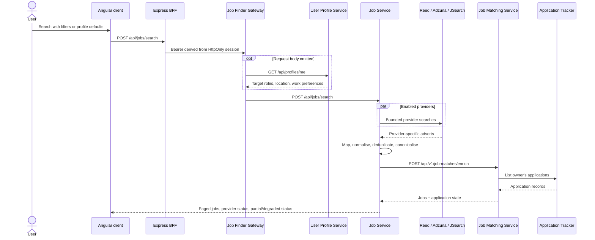

# Job search and matching

## Search path

## Search inputs

The preferred client flow sends a request body assembled from the current profile. If the body is omitted, Job Finder Gateway fetches User Profile and requires at least one target role and a location. Job Service bounds roles, page/page size, provider selection, results, deadlines, and sort values.

## Provider fan-out

Job Service calls enabled provider adapters through a bounded executor. A provider timeout, rate limit, bad configuration, or temporary failure is represented in `providerResults`. The whole request can still return a `PARTIAL` result when at least one provider succeeds. If none succeeds, the service returns unavailable.

In fixture profiles, provider gateways obtain synthetic responses from System Data. Live overlays switch Reed, Adzuna, and JSearch independently and require their credentials.

## Canonicalisation and deduplication

Provider adapters map responses into the canonical job model and attach field/source provenance. Deduplication considers:

- canonical apply URLs with tracking parameters removed;
- overlapping source/apply URLs; or
- normalised company, similar title, same location, compatible dates, and compatible description.

Duplicates are merged, source references are retained, and a stable `job_<sha256>` canonical ID is derived. Search results are held in bounded in-memory caches; only an explicit save persists a job.

## What “matching” means today

!!! info "Application-state matching, not suitability scoring"
    `job-matching-service` does not read candidate skills or calculate a fit score on `develop`. It loads the claimant's Application Tracker records and matches by canonical job ID, then provider/external ID, then exact normalised title/company/location. It enriches the job with application status, application ID, document IDs, and timestamps, or marks it `NEW`.

If Job Matching times out or fails, Job Service returns provider results with a degraded matching status. `matchScore` exists in the canonical DTO but this flow does not set it.

## Saving a job

`POST /api/jobs/saved` passes through BFF and Job Finder Gateway to Job Service. Job Service stores an owner-scoped record and an immutable canonical/source JSON snapshot in its PostgreSQL database. Re-saving identical canonical content is idempotent; later provider changes create a new snapshot rather than mutating history.

## Data touched

| Data | Behaviour |
|---|---|
| Provider search results | Normalised and cached in memory; not stored automatically |
| Profile defaults | Read from User Profile Service when needed |
| Application state | Read from Application Tracker through Job Matching |
| Saved jobs | Written only by Job Service to its own PostgreSQL database |
