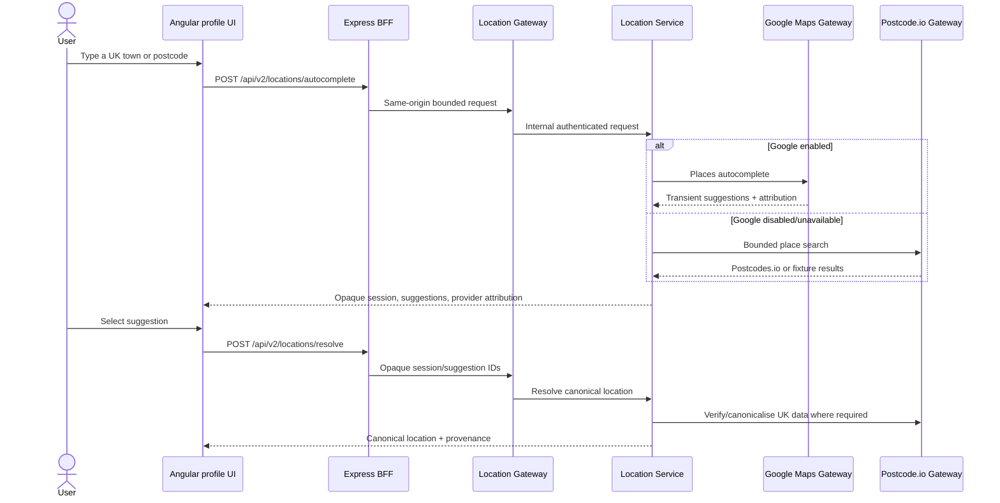
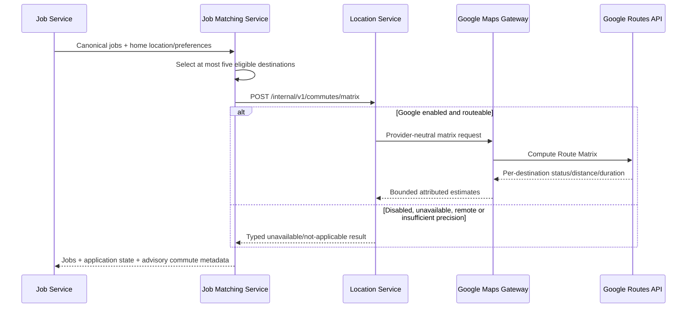

# Location and commute

## Candidate location path

Location Gateway is the public boundary. Location Service owns provider
selection, transient suggestion sessions, canonical resolution and provider-
neutral contracts. Google Maps Gateway alone receives the Google credential and
Google DTOs. Postcode.io Gateway remains the authority for persistable UK
postcode data and also backs the legacy bounded GET place/postcode routes.

The browser displays `Google Maps` attribution beside Google suggestions. A
Google Place ID can be retained as a provider reference where permitted, but
autocomplete labels, address components, coordinates and provider payloads are
not persisted as profile truth. User Profile owns the selected canonical
location and preferences.

## Advisory commute path

Commute assessment supports drive and transit preferences, remains advisory,
and does not filter out a job. Route results are transient and are not written
to a profile, saved job or application. Partial provider failures degrade to a
typed unavailable state rather than invented distance or journey time.

## Modes and evidence

- Base and E2E profiles keep Google disabled and use deterministic Postcodes.io
  fixtures.
- `google-maps-smoke` enables only Google for a bounded live validation.
- `real-providers` enables Google alongside the real job-provider and OpenAI
  paths; Stripe remains fixture-backed.
- On 11 August 2026 the current manual stack returned five Google-attributed
  suggestions through the normal browser/BFF/gateway/service path. This proves
  integration, not provider reliability or production approval.

Privacy/terms notices, explicit enablement, server-only credentials, request
limits and provider attribution remain part of the activation boundary. See
the [configuration reference](../operations/configuration.md) and the operator
runbook in `docs/GOOGLE_MAPS_ACTIVATION.md`.
