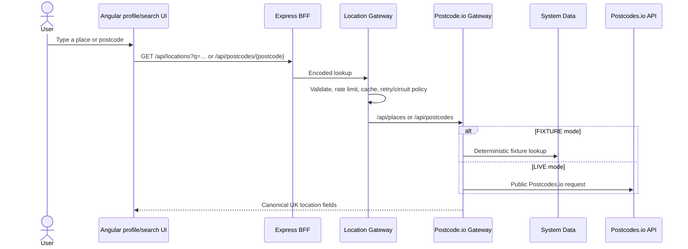

# Location

## Implemented path on `develop`

Place queries and UK postcodes/outcodes are validated and bounded. Location Gateway returns at most ten place results and caches successful lookups. It has retry, timeout, circuit-breaker, and caller rate-limit controls around Postcode.io Gateway.

The selected canonical location—postcode, place, region/district, coordinates, and provider provenance where present—is stored as part of User Profile. Location services themselves own no database.

## Commute and Google Maps status

!!! warning "Not implemented on develop"
    `location-service` and `google-maps-gateway` contain only repository bootstrap files on `develop`. They are not built or composed by the infrastructure catalogue. There is no backend-to-backend commute assessment path to document from this source of truth.

Commute preferences exist in profile data and canonical job locations can carry coordinates, but route assessment, travel duration, Google configuration switches, and provenance from Google Maps are **not confirmed from current implementation**.
