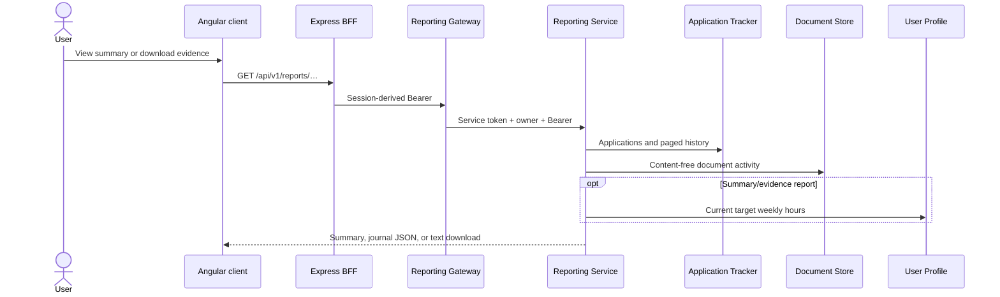
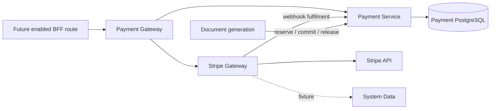

# Reporting and payments

## Reporting

Reporting Service is stateless and read-only. It builds:

- totals by application status;
- a merged, ordered application/document activity timeline;
- deterministic Universal Credit journal text;
- a plain-text evidence download; and
- indicative weekly commitment progress.

The commitment calculation converts application statuses into estimated hours. The response is a user aid, not an official UC submission or measured activity log. A Document Store activity failure is tolerated and produces a reduced timeline; owner and service credentials remain mandatory.

## Payment backend

Payment Service owns an append-only AI-credit ledger: wallets, transactions, and expiring reservations. Document generation uses internal owner-scoped endpoints to estimate, reserve, read, commit, or release usage. Payment Gateway exposes wallet/history/pricing/demo purchase/estimate and delegates checkout session creation to Stripe Gateway. Stripe Gateway validates Stripe webhooks before crediting Payment Service.

## User-visible status

!!! danger "Payments are disabled at the browser boundary"
    The client contains a hardened future payment proxy, but `src/server.ts` does not register it. `/api/v1/payment/**` is caught by the fail-closed boundary and returns `404 FEATURE_NOT_AVAILABLE`. The backend services are composed in `full-fixture`; that does not make payments user-accessible.

Local Stripe Gateway runs in fixture mode and uses System Data. Live Stripe secrets are forbidden by the current standard runtime profiles. The payment/Stripe repositories describe themselves as beta baselines, not production-ready live payment releases.
