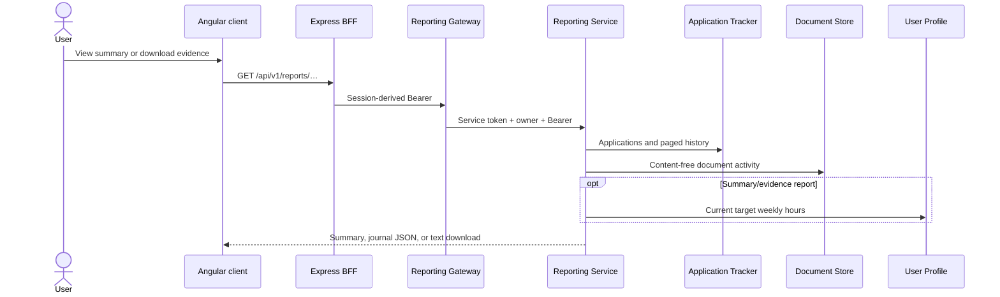
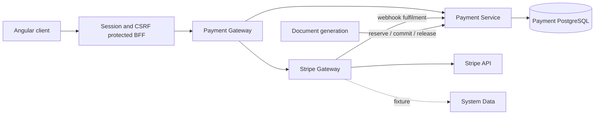

# Reporting and payments

## Reporting

Reporting Service is stateless and read-only. It builds:

- totals by application status;
- a merged, ordered application/document activity timeline;
- deterministic Universal Credit journal text;
- a plain-text evidence download; and
- indicative weekly commitment progress.

The commitment calculation converts application statuses into estimated hours. The response is a user aid, not an official UC submission or measured activity log. A Document Store activity failure is tolerated and produces a reduced timeline; owner and service credentials remain mandatory.

## Document-credit payments

Payment Service owns the document-credit catalogue, order pricing snapshots,
wallets, append-only ledger, promotion reservations and expiring document
reservations. Document generation reserves one credit for each requested
output, commits only after successful storage/delivery, and releases a failed
or eligible pre-delivery cancellation without charging again.

The browser can read the catalogue, Checkout readiness, wallet, history and an
owner-scoped order status through the BFF. Checkout mutations require both the
authenticated server session and matching CSRF evidence. Browser requests do
not supply a payment owner, price, currency, quantity, tax status or bonus;
those values come from Payment Service's reviewed catalogue and immutable order
snapshot.

Stripe Gateway creates owned Checkout Sessions with inline server-owned GBP
`price_data`. The return URL contains only an order UUID and cannot fulfil an
order. The gateway verifies the Stripe signature before forwarding completion,
expiry, refund or dispute evidence to Payment Service. Provider-event and
ledger replay guards make fulfilment/reversal idempotent.

## User-visible status

!!! warning "Checkout is implemented but release-gated"
    The client and BFF payment routes are active, but Checkout availability is
    server-authoritative and currently disabled in the checked-in release
    configuration. Catalogue, wallet and history may be shown without making a
    charge. No redirect is offered unless Payment Service, Stripe Gateway,
    seller/tax/legal configuration and the protected release approvals all
    report ready.

The isolated acceptance stack uses a signed, test-profile-only Stripe fixture
and proves successful completion replay, expiry with no grant, and a cancel
return followed by late completion. Fixture controls and System Data are not
deployed as production services, and the exact production Stripe image is
probed to show those conditional controls are dormant.

The launch catalogue is non-renewing: 2 free document credits, then 10 for
£7.99, 25 for £16.99, or 60 for £34.99. A document credit is one generated CV
or cover letter. The displayed GBP price is the Checkout total; automatic
renewal is false. Promotion bonuses are displayed only while the server says
the bounded promotion is available.

The exact test rehearsal, live credentials, webhook event set, first-charge
verification and rollback sequence is maintained in the Stripe Gateway
`docs/STRIPE_CUTOVER.md`. Production remains deliberately dark until those
steps and the human-reviewed legal, seller and tax inputs are complete.
