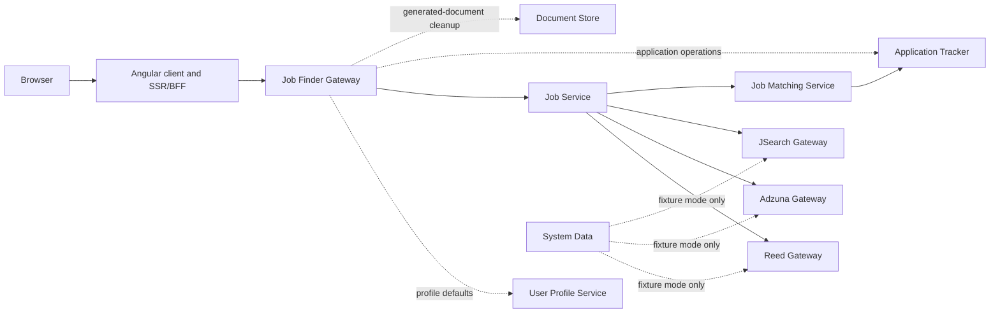

# ADR 0001: Job Search architecture and ownership

- Status: Accepted for private-beta hardening
- Date: 2026-07-24
- Decision owner: Job Seeker Copilot
- Source issue: [SEARCH-01](https://github.com/jobseekercopilot/job-finder-gateway/issues/2)

## Context

The Job Search code was extracted into independently versioned repositories,
but the implemented request path and its ownership boundaries were not recorded
as one approved decision. That made it possible to put fixes in the wrong
service, duplicate contracts, or absorb Application Tracking, Job Matching,
Documents, User Management, or test-fixture work into the Job Search scope.

This decision records the target ownership already represented by the current
repositories. It does not declare the path beta-ready and does not close the
hardening issues linked from the service audits.

## Decision

### Runtime request path

The normal search request is:

1. The browser uses the client SSR/BFF; it does not hold provider credentials
   or invent a user identity.
2. Job Finder verifies the platform access token, optionally loads the
   subject-owned profile, and sends a bounded search request plus the original
   Bearer token to Job Service.
3. Job Service independently verifies the token, derives the subject from it,
   fans out to enabled provider gateways, creates canonical jobs, normalises,
   calculates distance, deduplicates, and prepares the stable response.
4. Job Service sends the canonical results to Job Matching.
5. Job Matching queries Application Tracker for the authenticated subject's
   application state and returns typed enrichment. It does not find or persist
   jobs.
6. Job Service returns the enriched canonical response through Job Finder.

Application list and lifecycle mutations are a separate Job Finder to
Application Tracker path. Generated-document cleanup during an approved
withdrawal is a separate Document Store dependency. Job Finder pre-authorizes
the application ownership, but Document Store must enforce its own owner scope
before beta. Neither path changes ownership of search aggregation.

### Responsibility owners

| Concern | Owner | Boundary |
|---|---|---|
| Browser Job Search experience and same-origin BFF route | `job-seeker-copilot-client` | Uses reviewed backend contracts; does not own backend identity, canonical jobs, or provider rules |
| Account, session, token issuance, signing keys, issuer and audience contract | User Management (`authentication-service` and `user-management-gateway`) | Job Search consumes the platform token contract; every resource service verifies tokens independently |
| Profile-owned search defaults and home coordinates | `user-profile-service` | Returns only the authenticated subject's profile; does not orchestrate searches |
| Browser-facing Job Search authentication and request orchestration | `job-finder-gateway` | Does not mint identity, own provider DTOs, canonicalise jobs, or persist application state |
| Canonical job model and stable Job Search API | `job-service` | Provider-specific DTOs stop at provider adapters |
| Provider fan-out and partial-result aggregation | `job-service` | Provider gateways own only their individual provider boundary |
| Deterministic normalisation, distance enrichment and cross-provider deduplication | `job-service` | Job Matching adds application state only after these stages |
| Saved-job persistence and saved-job ownership | `job-service` | Application lifecycle records remain owned by Application Tracker |
| Provider credentials, request mapping, response mapping and provider-specific compliance | `reed-gateway`, `adzuna-gateway`, `jsearch-gateway`, `nhs-jobs-gateway`, and `apprenticeships-gateway` respectively | Credentials and external DTOs do not enter Job Finder or Job Service |
| Existing-application enrichment of canonical search results | `job-matching-service` | Reads owner-scoped Application Tracker state; does not store jobs or applications |
| Application records, lifecycle transitions and document references | `application-tracker-service` | Job Finder and Job Matching are consumers, not alternate stores |
| Synthetic named states and deterministic provider fixtures | `system-data-service` | Non-production only; never a production job, user, application, or document store |
| Browser journey definitions, failure-sensitive assertions and evidence | `e2e` | Requests named System Data states; does not seed service databases directly |
| Compose topology, compatible-revision manifest and shared contract/build policy | `infrastructure` | Does not own service source, service contracts, or generated clients |

Location and Postcode services own profile/location acquisition and
canonicalisation before a search. Job Search consumes the resulting coordinates
from the profile or request and does not make those services part of provider
fan-out.

### Identity and trust

- User Management owns token issuance and the published RS256/JWKS contract.
- The client BFF preserves the platform session boundary and never trusts
  browser-supplied `Authorization` or `X-User-Id` as an alternate identity.
- Job Finder and Job Service independently validate signature, issuer,
  audience, expiry, token type, and nonblank subject.
- The original validated Bearer token crosses end-user resource boundaries. A
  gateway may not replace it with a raw user header.
- Application Tracker owns the atomic subject-to-application authorization
  decision. Job Finder pre-authorization is defence in depth, not the final
  ownership authority.
- Job Matching must use an authenticated subject and trusted service boundary
  before it can be enabled for private beta.

### Contracts and generated clients

- Every API producer owns, tests, reviews, and versions its OpenAPI source.
- A consumer records the producer repository, immutable revision, source path,
  and checksum, then generates its client with a pinned generator.
- Compatibility and semantic-drift checks run in producer and consumer CI.
- Generated source and binary artefacts are reproducible outputs and are not
  committed.
- Infrastructure owns common policy and compatible-revision coordination, but
  never becomes the source of a service contract.
- The Angular repository's canonical generated-client root is `src/app/api`.
  Each producer uses a stable subdirectory when names could collide. The
  legacy top-level `generated/api` tree is not an approved second location and
  must be migrated before those capabilities are enabled.

### Dependency boundaries

- Job Matching and Application Tracker are required runtime dependencies for
  application-state enrichment, but retain their separate epics and contracts.
- User Management and User Profile are upstream identity/profile dependencies,
  not Job Search-owned implementations.
- Document generation, document storage beyond bounded withdrawal cleanup,
  payments, and reporting are outside the search-result request.
- Provider credentials, commercial terms, attribution, storage rights, quotas,
  and provider failure controls remain owned by the individual provider and
  compliance issues.
- System Data and E2E modes must remain isolated from live provider and
  production data paths.

## Consequences

- SEARCH-03 can inventory contracts against named producer and consumer owners
  and can remove the duplicate Angular generated-client location.
- Canonical-model, normalisation, deduplication, saved-job, provider,
  matching, application, and E2E changes stay in their owning repositories.
- Existing manual clients, sequential calls, unsafe cache semantics, missing
  persistence, and incomplete failure handling remain tracked work; this ADR
  does not approve them for beta.
- A change to an ownership boundary requires an ADR update and review by both
  affected repository owners.

## Validation

Every repository in the Job Search path links this decision from its README.
The diagram and ownership table are reviewed against current controller,
client, contract, and orchestration code. Final runtime proof remains owned by
the Job Search and E2E beta-readiness issues.
