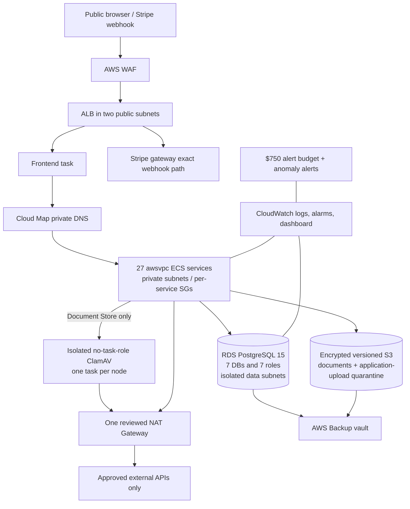

# AWS public-beta architecture

Status: design and code complete for offline review; no AWS resource has been
created by this work.

## Lean and HA shapes

| Control | Lean public beta | Reviewed HA upgrade |
|---|---:|---:|
| ECS instances | exactly 1 `m7i.2xlarge` | exactly 2 |
| ASG maximum | 1 | 2 |
| Host refresh | drain/replace one; maintenance outage | drain/replace one of two |
| NAT Gateways | 1 | 2 |
| RDS | Single-AZ `db.t4g.medium` | Multi-AZ |
| Service deployment | stop old, then start new (`0/100`) | ordered stop-first (`0/100`) |
| Service maximum count | 1 | 2 |
| DB pool budget | 62 including operator reserve | 104 including replacement reserve |

The lean fleet reserves 5,504 CPU units and 21,504 MiB including ClamAV and a
one-shot operator, before 1,024 CPU units and 4,096 MiB of node headroom. It
uses 29 awsvpc task slots. Terraform enables account-level `awsvpcTrunking`,
pins an ECS-optimised AL2023 AMI at release time, and refuses capacity beyond
the reviewed table. The release operator also refuses to proceed unless every
container instance is agent-connected and has an `ecs.awsvpc-trunk-id`.

Host refreshes are also stop-first and capacity-bounded. The ASG references
the launch template's exact numeric version, never the moving `$Latest`
alias. Its refresh envelope is `0/100` in lean mode and `50/100` in HA mode,
so it cannot add an unpriced second/third host. Because ECS managed termination
protection marks busy instances as scale-in protected, the refresh explicitly
uses `Refresh` for protected instances; ECS managed draining then stops tasks
gracefully. Matching instances are skipped and a failed host refresh is
automatically rolled back. This host-level rollback does not replace the
application/database rollback procedure.

Private subnets are `/20` ranges across two London AZs, leaving IP headroom
well beyond the 29-task baseline. The release preflight requires at least eight
additional free addresses and queries registered ECS CPU, memory and branch-ENI
capacity before a task starts. Data subnets have no internet route. S3 uses a
Gateway endpoint; only enabled provider/AWS clients and the isolated ClamAV
scanner's signature refresh receive public HTTPS egress through NAT.

## Network and identity boundaries

Every service has its own security group. Terraform derives exact source →
target rules from reviewed service URL declarations and adds only:

- ALB → frontend `3000` and ALB → Stripe `8100`;
- DB-owning service/operator → RDS `5432`;
- release operator → each declared health port; and
- exact VPC DNS, declared dependency egress and independently approved external
  HTTPS egress. ClamAV gets a separate security group with HTTPS-only signature
  refresh and accepts `3310` only from Document Store.

There is no shared self-referencing task security group. ECS execution roles
can retrieve only a service's declared Secrets Manager ARNs. Task roles are
empty by default except Document Store S3/KMS, Authentication SES, and optional
break-glass ECS Exec. Document Store explicitly uses `task-role` credentials;
static AWS keys and custom endpoints are forbidden. ClamAV runs as an independent
ECS service with an execution role only, no task role and blocked EC2 metadata,
so the upstream scanner cannot inherit Document Store's S3/KMS identity.
Application task definitions also set explicit numeric non-root users and
hardened, bounded `/tmp` mounts.

## Release and image contract

All 27 services, ClamAV and the release operator are addressed by immutable ECR
digests. A release manifest is accepted only when it comes from `main`, has
passed ECR scanning, contains exact 40-character application/operator source
revisions plus the reviewed ClamAV LTS version, and attests:

- Document Store task-role credentials and S3 KMS support;
- the exact Adzuna/JSearch runtime health dependencies;
- the exact tested Postcodes Gateway → Location Service → Location Gateway
  Northern Ireland/`BT` rejection chain and all three OpenAPI hashes, with the
  provider gate disabled unless its separate approval is complete;
- the exact final tested Authentication, UMG, Document Generation, Payment,
  Payment Gateway and Stripe Gateway production-v2 revisions and OpenAPI hashes;
- separate ancestor-verified System Data, E2E and Infrastructure provenance for
  the isolated signed-settlement acceptance run (36 healthy services, 4/4
  scenarios, 33/33 steps). System Data and E2E are excluded from production
  tasks, ECR repositories and ALB routes. The reviewed Stripe JAR does contain
  dormant fixture classes, so the builder tests the truthful boundary on the
  exact image: production-profile `FIXTURE` startup fails, `DISABLED` is
  healthy, the control route is 404 and its mode-conditional controller,
  service, provider and store beans are not registered. Fixture tokens and
  signing secrets are absent from the production task definition and fixture
  routes remain absent from public OpenAPI;
- one protected-`main` Client SSR/BFF OCI contract and one protected-`main`
  Landing static/config/SAM contract. The release binds the Client digest and
  Landing tar/config/template checksums, while recording Landing as
  `NOT_DEPLOYED`;
- every emitted container health command exists in its exact image; and
- all seven DB images are centrally derived from their exact tested image by
  adding one reviewed SHA-256-pinned AWS RDS CA bundle, and the independently
  built operator contains the same file, at `/etc/jsc/rds/global-bundle.pem`.

The protected release accepts an artifact only when GitHub's immutable artifact
SHA-256 passes fail-closed download verification, the workspace-lock hash, protected launch-approval
hash, Client/Landing evidence, successful build workflow and exact `main`
infrastructure revision all agree. The build's GitHub App token is
contents-read-only and limited to the locked repository set.

Source compilation/tests and ECR publication are separate jobs. The prepare job
has no `id-token: write` permission and explicitly rejects AWS credentials; it
emits a checksum-bound, one-day prepared Docker archive. The publisher executes
no repository build code: it verifies/loads that archive, validates Landing and
legal inputs, and only then assumes the build-only OIDC role to push/scan exact
images. AWS credentials are cleared before release-evidence upload actions.

Seven bounded Hikari pools use maximum six/minimum one connections with short
connection/validation timeouts. The shared RDS budget preserves 20 connections
for migration and operator access: 62 connections in the lean shape and 104 at
the reviewed two-task HA autoscaling ceiling. Both shapes use ordered stop-first
replacement; neither assumes four simultaneous copies. `DatabaseConnections >=
100`, low storage, low free memory and high CPU are alarmed.

The protected approval manifest owns one reviewed public legal contract. Its
seller form, tax status, version, effective date, identity/contact/ICO status,
published Terms/Privacy URLs, exact immutable Client/Landing legal-artifact
checksums and retention periods are bound into the release. The protected
builder recomputes those checksums from the exact locked source files rather
than trusting approval metadata alone. Terraform supplies the same version to the Client and
Authentication registration requirements, and requires its seller/tax/terms/
retention fields to match Payment. `NOT_CONFIGURED` or an unreviewed legal
contract prevents even the private application fleet from starting.
The declared account/document deletion window cannot understate the 35-day
backup/noncurrent recovery window.

## Edge and data controls

The HTTPS listener returns a fixed `503` until an exact release has both DB
bootstrap and private-preflight SSM attestations. WAF applies the full AWS
Common Rule Set everywhere. Only two exact authenticated multipart paths get a
`Count` override for `SizeRestrictions_BODY`; all other CRS rules remain active
and the BFF/application retain their 10/25 MiB and content validation.

RDS, S3, secrets, EBS, backups and ECS Exec use encryption. Documents are
versioned and backed up. The one reviewed `securityLogRetentionDays` value is
applied exactly to ALB/S3 access logs and every CloudWatch diagnostic/security
log group; the current lean default is 30 days. VPC flow logs
store rejected traffic only. WAF request sampling is disabled to avoid payload
exposure. Application scratch uses bounded hardened task `tmpfs`; ClamAV
signatures start from the immutable image, refresh only on the disposable task
layer and are recreated rather than restored. Its socket/log/scratch paths use
bounded UID/GID-owned task `tmpfs`. See [stateful storage](stateful-storage.md) and
[backup/restore](backup-restore.md).

Break-glass darkening is intentionally independent of launch-readiness
approvals and 90-day build-artifact retention. A protected `main` workflow
binds the operator's release ID to applied remote-state outputs, fixes both the
Stripe webhook rule and listener default at `503`, verifies the public edge,
then suspends autoscaling, lowers its minima and drains the application fleet. Normal
Terraform reconciliation remains a separate reviewed recovery action.

## Ownership boundary

The landing site and its SAM waitlist/contact backend remain a separate release
unit. This stack consumes only the existing Route 53 hosted-zone ID and SES
domain-identity/DKIM contract; it owns the separate application account-email
configuration set and does not update the landing stack. The
central build emits its immutable, checksum-bound static/SAM evidence without
publishing it. See [landing integration](landing-integration.md).
